# Next.js MERN Prompt Generator – AI & Token Optimization

## Overview
Build a RESTful MERN stack app using Next.js for the frontend. The app enables users to generate, refine, and export AI prompts, optimized for token efficiency and AI compatibility. Features include prompt atomization for complex problems, user guidance, TDD, recursive error correction, and a "concise/verbose" toggle.

## Key Features
- **Next.js frontend** (React, SSR/SSG supported)
- **Express/Node.js REST API** backend
- **MongoDB** for prompt/session/history storage
- **Image upload and analysis** for visual context-aware prompts
- **Prompt generation** optimized for clarity and minimal token use
- **Prompt atomization** for multi-step/complex projects
- **One-shot solution preambles** with TDD instructions
- **AI model recommendations** based on prompt content
- **User guidance**: clarifying questions, tips
- **TDD throughout** (Jest, React Testing Library, Supertest)
- **Recursive error correction**
- **Export options**: Markdown, plain text, clipboard

## Prompt Optimization Guidelines
- Make prompts concise—minimize tokens while preserving clarity and effectiveness.
- Default to concise; switch to verbose only if required for efficacy.
- Use structured/bulleted formats when possible.
- Review and edit for relevance, clarity, and brevity before export.

### Example: Optimized AI Prompt
**Verbose:**  
"Please build a RESTful API in Node.js and Express that manages a list of users, supporting create, read, update, and delete operations."

**Optimized:**  
"Node.js/Express REST API: CRUD for users (create, read, update, delete)."

---

## Best Practice
Review generated prompts for brevity, clarity, and relevance. Use concise instructions as default unless detailed context is essential.

## Directory Structure

```mermaid
graph TD
    Root["mern-next-prompt-generator/"] --> Client["client/ (Next.js frontend)"]
    Root --> Server["server/ (Express backend)"]
    Root --> ENV[".env (MongoDB URI, etc.)"]
    Root --> README["README.md"]
    
    %% Client structure
    Client --> Pages["pages/"]
    Client --> Components["components/"]
    Client --> Utils["utils/"]
    Client --> Tests["__tests__/"]
    Client --> ClientPackage["package.json"]
    Client --> ClientJest["jest.config.js"]
    
    %% Pages structure
    Pages --> Index["index.js (Main prompt UI)"]
    Pages --> API["api/"]
    
    %% API routes
    API --> OptimizeAPI["optimize.js (API route: prompt optimization)"]
    API --> AtomizeAPI["atomize.js (API route: prompt atomization)"]
    API --> ImageUploadAPI["imageUpload.js (API route: image upload)"]
    API --> ImagePromptAPI["imagePrompt.js (API route: image analysis)"]
    
    %% Components
    Components --> PromptForm["PromptForm.js"]
    Components --> PromptList["PromptList.js"]
    Components --> AtomizedPrompts["AtomizedPrompts.js"]
    Components --> ImageUpload["ImageUpload.js"]
    
    %% Utils
    Utils --> OptimizeUtil["optimizePrompt.js"]
    Utils --> AtomizeUtil["atomize.js"]
    Utils --> PreambleUtil["preambleGenerator.js"]
    
    %% Tests
    Tests --> PromptFormTest["PromptForm.test.js"]
    Tests --> ImageUploadTest["ImageUpload.test.js"]
    Tests --> PromptFormImageTest["PromptFormImage.test.js"]
    Tests --> PreambleTest["preambleGenerator.test.js"]
    
    %% Server structure
    Server --> Models["models/"]
    Server --> Routes["routes/"]
    Server --> Controllers["controllers/"]
    Server --> Utils["utils/"]
    Server --> ServerTests["tests/"]
    Server --> App["app.js"]
    Server --> ServerJS["server.js"]
    Server --> ServerPackage["package.json"]
    Server --> ServerJest["jest.config.js"]
    Server --> Uploads["uploads/ (Image storage)"]
    
    %% Models
    Models --> PromptModel["Prompt.js"]
    
    %% Routes
    Routes --> PromptsRoute["prompts.js"]
    Routes --> ImagesRoute["images.js"]
    
    %% Controllers
    Controllers --> PromptController["promptController.js"]
    Controllers --> ImageController["imageController.js"]
    
    %% Server Tests
    ServerTests --> PromptTest["prompt.test.js"]
    ServerTests --> ImagesTest["images.test.js"]
    
    %% Server Utils
    Utils --> ImageAnalyzer["imageAnalyzer.js"]

    classDef default fill:#f9f9f9,stroke:#333,stroke-width:1px;
    classDef root fill:#e1f5fe,stroke:#01579b,stroke-width:2px;
    classDef mainSection fill:#e8f5e9,stroke:#2e7d32,stroke-width:1px;
    classDef file fill:#fff3e0,stroke:#e65100,stroke-width:1px;
    
    class Root root;
    class Client,Server mainSection;
    class Index,OptimizeAPI,AtomizeAPI,PromptForm,PromptList,AtomizedPrompts,OptimizeUtil,AtomizeUtil,PromptFormTest,PromptModel,PromptsRoute,PromptController,PromptTest,App,ServerJS,ENV,README,ClientPackage,ClientJest,ServerPackage,ServerJest file;
```



You can also view this as a traditional directory tree:

```
mern-next-prompt-generator/
│
├── client/                   # Next.js frontend
│   ├── pages/
│   │   ├── index.js          # Main prompt UI
│   │   ├── api/
│   │   │   ├── optimize.js   # API route: prompt optimization
│   │   │   └── atomize.js    # API route: prompt atomization
│   ├── components/
│   │   ├── PromptForm.js
│   │   ├── PromptList.js
│   │   └── AtomizedPrompts.js
│   ├── utils/
│   │   ├── optimizePrompt.js
│   │   └── atomize.js
│   ├── __tests__/
│   │   └── PromptForm.test.js
│   ├── package.json
│   └── jest.config.js
│
├── server/                   # Express backend
│   ├── models/
│   │   └── Prompt.js
│   ├── routes/
│   │   └── prompts.js
│   ├── controllers/
│   │   └── promptController.js
│   ├── tests/
│   │   └── prompt.test.js
│   ├── app.js
│   ├── server.js
│   ├── package.json
│   └── jest.config.js
│
├── .env                      # MongoDB URI, etc.
└── README.md
```
